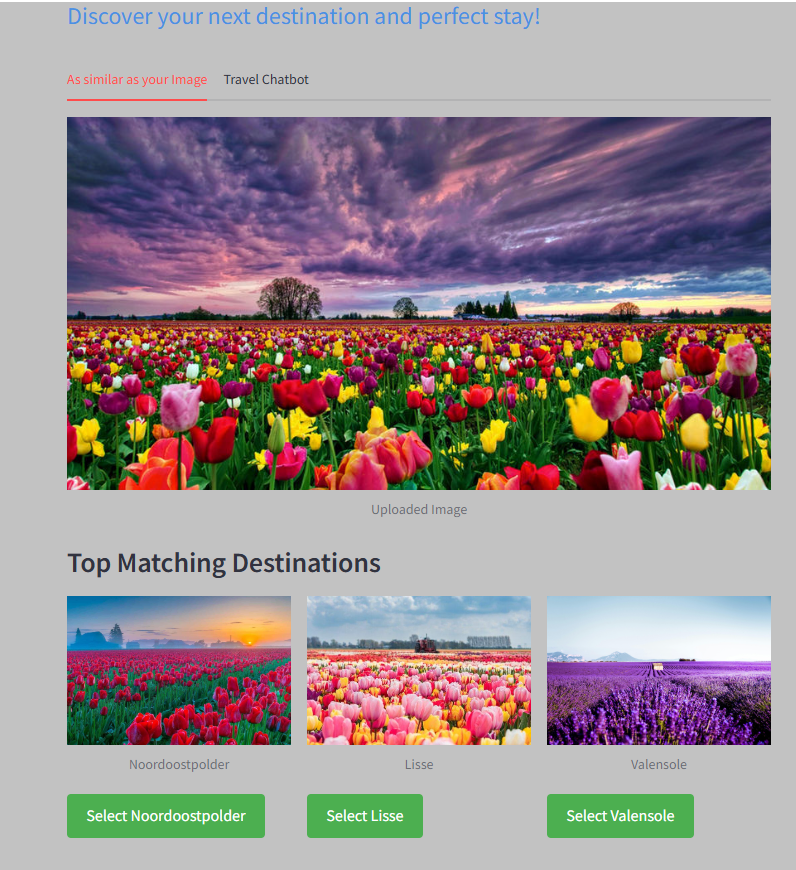
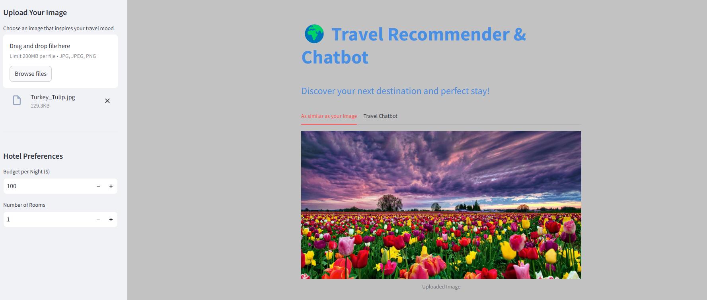
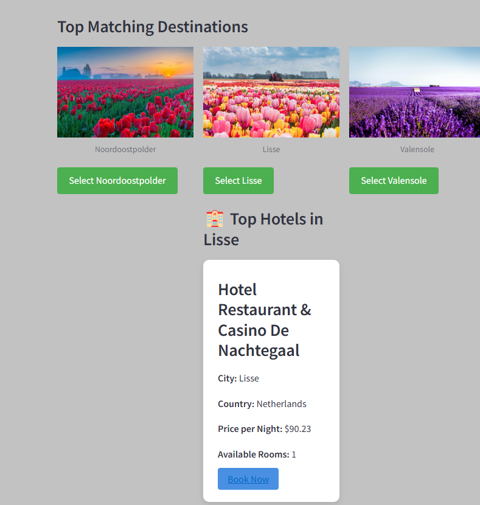
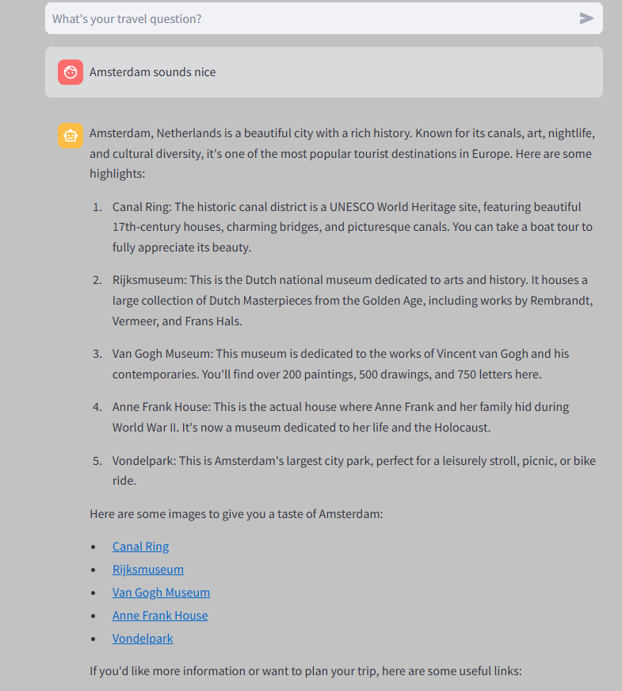
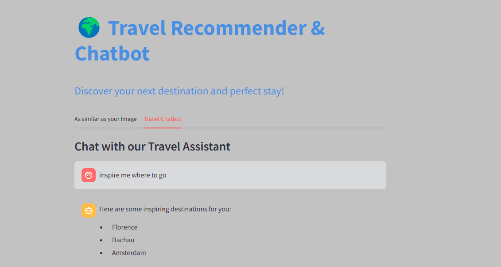

# Travel Recommender & Chatbot

A Streamlit-based travel recommendation system that combines image-based destination matching with an intelligent chatbot for personalized travel and hotel recommendations.

## 🌟 Features

- **Image-Based Destination Matching**: Upload an image that inspires your travel mood, and get matching destination recommendations
- **Intelligent Travel Chatbot**: Get personalized travel advice and recommendations through natural conversation
- **Hotel Recommendations**: Find hotels that match your preferences and budget
- **Interactive Interface**: User-friendly interface with easy navigation and visual feedback

## 🛠️ Installation

1. Clone the repository:
```bash
git clone https://github.com/yourusername/travel-recommender.git
cd travel-recommender
```

2. Create a virtual environment and activate it:
```bash
python -m venv venv
source venv/bin/activate  # On Windows use: venv\Scripts\activate
```

3. Install the required packages:
```bash
pip install -r requirements.txt
python -m spacy download en_core_web_sm
```

4. Set up your environment variables:
Create a `.env` file in the root directory and add your HuggingFace token:
```
HUGGINGFACE_TOKEN=your_token_here
```

5. Prepare the data:
- Place your data files in the `data/` directory:
  - `combined.csv`: Dataset containing hotel and destination information
  - `image_features_model_2.pkl`: Pre-trained image features
  - `faiss_index/`: Directory containing the FAISS index for the chatbot

## 🚀 Usage

1. Start the Streamlit app:
```bash
streamlit run app.py
```

2. Open your web browser and navigate to the provided URL (typically http://localhost:8501)

3. Use the application:
   - Upload an inspirational image to get destination matches
   - Chat with the travel assistant for personalized recommendations
   - Set your preferences for hotel recommendations

## 📁 Project Structure

```
travel_recommender/
├── README.md
├── requirements.txt
├── .gitignore
├── app.py                  # Main Streamlit application
├── utils/
│   ├── __init__.py
│   ├── image_processor.py  # Image processing utilities
│   ├── hotel_recommender.py# Hotel recommendation functions
│   └── chatbot.py         # Chatbot setup and utilities
├── data/
│   ├── combined.csv       # Hotel and destination data
│   ├── image_features_model_2.pkl  # Pre-trained image features
│   └── faiss_index/       # FAISS index for chatbot
├── assets/
│   └── styles.css         # Custom CSS styles
└── .streamlit/
    └── config.toml        # Streamlit configuration
```

## 🔧 Configuration

The application can be configured through the `.streamlit/config.toml` file. Key configurations include:

- Theme customization
- Server settings
- Cache settings

## 📝 Data Preparation

1. **Hotel Data (combined.csv)**:
   - Required columns: city, country, hotel, number_of_rooms, budget, website
   - Format: CSV file with proper headers

2. **Image Features**:
   - Pre-processed image features using VGG16
   - Saved as a pickle file

3. **FAISS Index**:
   - Vector database for the chatbot
   - Generated from your travel knowledge base


## 🙏 Acknowledgments

- TensorFlow team for VGG16 model
- Hugging Face for the language models
- Streamlit team for the wonderful framework
- Contributors and maintainers of all dependencies

### Video Demo
[![Watch the demo]](https://streamable.com/rzejaj)

## ✨ Screenshots

### 🖼️ Image Upload and Matching
Upload any travel photo and get matching destinations!

<div align="center">
  
  
  
</div>

### 🏨 Hotel Recommendations
Get personalized hotel suggestions based on your preferences.

<table>
  <tr>
    <td width="50%">
      
      <p align="center"><em>Hotel Listings</em></p>
    </td>
  </tr>
</table>

### 🖼️ Travel Chatbot
Upload any travel photo and get matching destinations!

<div align="center">
  
  
  
</div>


